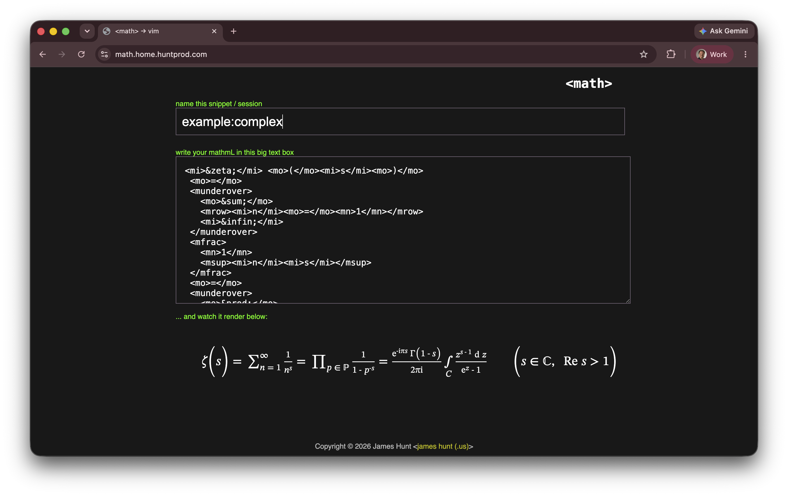

# MathML Editor

I got tired of not being able to play with raw MathML (which has
really come a **long way** in terms of browser support since last
I looked at it!) in the browser, so I wrote this dumb little web
editor.

You put in MathML; it renders it.

It uses broser local storage to remember what you were working on.
You can have lots of "files" in-flight concurrently; that's what
the text input above the editor is for.  If you want a new
session, give it a new name.

The code ships with some examples in case you want to see what all
MathML can do in your browser.  Try the names `example:basic`,
`example:sum` and `example:complex`.

## Deployment

You can run this in Docker like I do, or you can just chuck the
index.html file into nginx or a web server doc root somewhere.
It's 100% self-contained, relies on no third-party libraries, can
safely be locked down, CSP-wise, blah blah blah.

